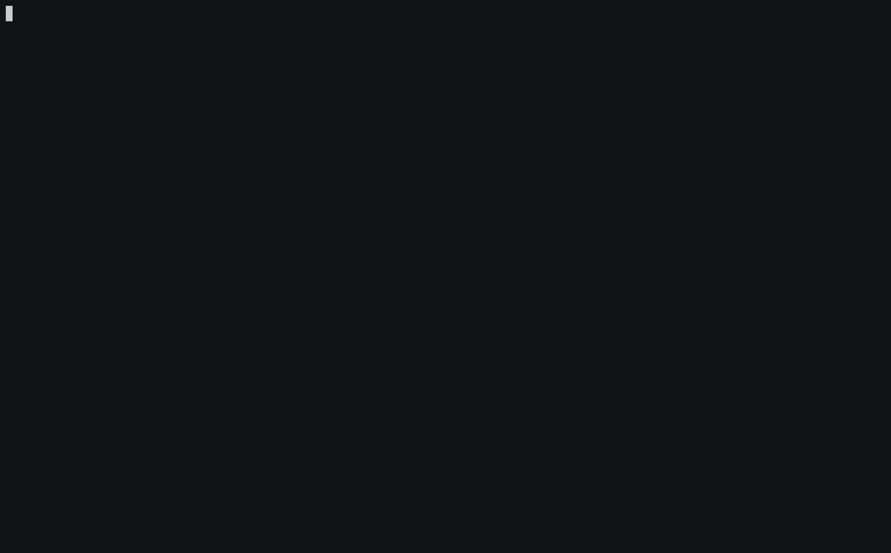

 # Brain-games

[](https://codeclimate.com/github/FineFreddy/project-lvl1-s308/maintainability)
[](https://codeclimate.com/github/FineFreddy/project-lvl1-s308)
[](https://travis-ci.org/FineFreddy/project-lvl1-s308)


## Description

This is CLI mini math games. Set consist of  6 games:

1. Even Or Not
2. Calculator
3. 'GCD'
4. Balance
5. Progression
6. Prime Or Not


## Installation
```
npm install -g project1-br_games
```

## Play
In terminal you have to type **brain-games** or name of one of given game. For example:
 **brain-even**

## Game's rules
Every game has 3 rounds. If you give right answer on any offered question it lets you go to the next round otherwise game over, which reports message with correct answer.

### Game 1 - Even Or Not
```
$ brain-even
```
#### Sample


### Game 2 - Calculator
```
$ brain-calc
```
#### Sample


### Game 3 - Greatest Common Divisor?
```
$ brain-gcd
```
#### Sample


### Game 4 - Balance
```
$ brain-balance
```
#### Sample



### Game 5 - Progression
```
$ brain-progression
```
#### Sample


### Game 6 - Prime Or Not
```
$ brain-prime
```
#### Sample


